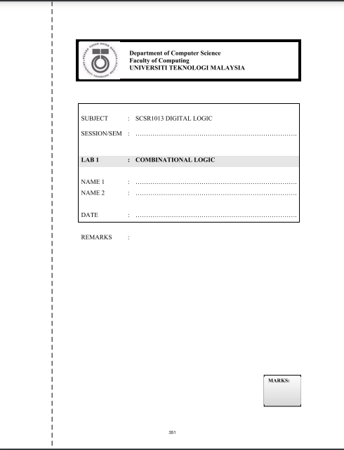
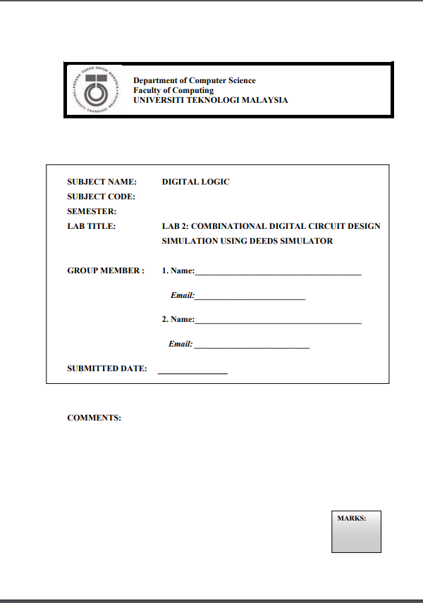
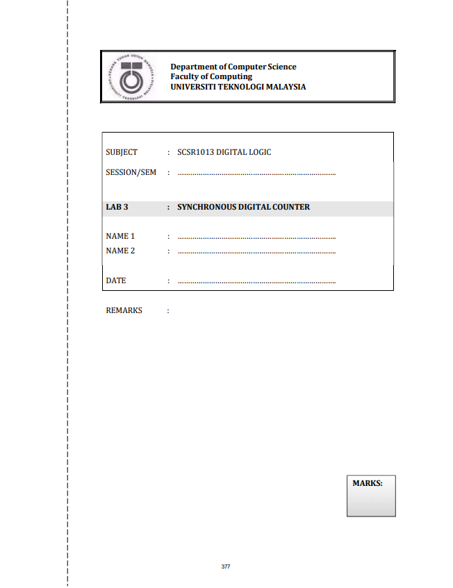

# SECR1013 DIGITAL LOGIC 💻
Digital electronics is the foundation of all microprocessor-based systems found in computers, robots, automobiles, and industrial control systems. 
This course introduces the students to digital electronics and provides a broad overview of many important concepts, components, and tools. Students will get up-to-date coverage of digital fundamentals-from basic concepts to programmable logic devices. 
Laboratory experiments provide hands-on experience with the simulator software, actual devices and circuits studied in the classroom.

# Lab Assessment 👩‍🔧
1️⃣ In the first lab session, we learned about the pin layout for different types of Integrated Circuit. We also did experiment by manipulating input using ETS-5000 Digital Training Kit.  
📝 Worksheet :   

- 💭 Reflection:
> The hands-on experience using ETS-5000 Kit has successfully bridge the gap between theory and real-life. It was a completely different feeling when you got to see how the output varies with input using bare eyes.
 
2️⃣ The second lab assessment required us to utilize DEEDS software, to perform multiple functions like demonstrating the output that varies with different input values and generating timing diagram.   
📝 Worksheet :   

- 💭 Reflection:
> After this lab assessment, I was able to utilize DEEDS software. DEEDS software is a powerful tool for us to verify our circuits. It helps me saves a lot of time, as manually draw and verify the circuit is very inconvenient and time consuming.
 
3️⃣ The third lab havent done. Please be patient :> 
📝 Worksheet :   

- 💭 Reflection:
> Makabaka mikabaka.
 

# Learning Material 📚
📖 Here's the link to digital logic textbook: [Textbook](https://github.com/XinYing0905/digital-logic/blob/main/Digital%20Logic%20Textbook.pdf)

# Reflection 🪞
I learned the basic of boolean algebra and logic gates operations as well as how to design a digital circuit. This course equipped me with the basic skills of designing logic circuits and introduce me to te world of digital electronics.

